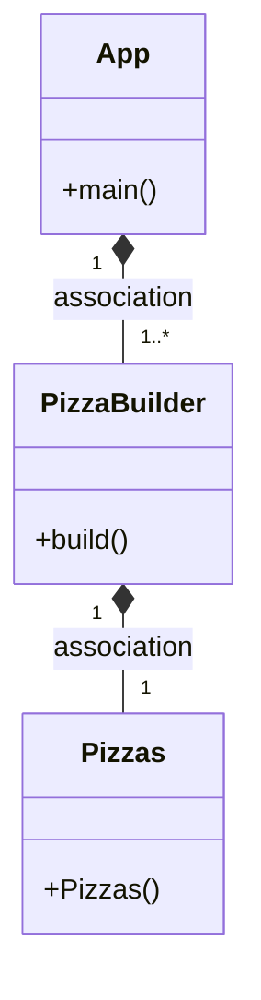

# Patron Builder

---

## ¿Que es el Patron Builder?
El patrón Builder permite construir objetos complejos de manera incremental, 
especificando cada paso en la creación del objeto. Esto ofrece mayor flexibilidad 
y control sobre el proceso de construcción, permitiendo la creación de objetos con 
diferentes configuraciones sin tener que modificar el código existente.

---

## Función de las clases
Primero tenemos la clase Pizza, esta clase tiene dos constructores, uno para 
ponerle valores. Y el otro por defecto con valores por defecto, este último lo 
usaremos con el patrón builder. Con sus respectivos setters y getters

Despues tenemos la clase builderPizzas. Que tiene un constructor default con 
el constructor por defecto de Pizzas. Despues tenemos setters que devuelven BuilderPizzas. 
Y por último tenemos el método build(), que devuelve el objeto del constructor.

---

## Diagrama de clases del Patron Builder

---

## ¿Podríamos combinarlo con el patrón Factory?
Para empezar si e posible combinar ambos patróns, facendo así que sexa 
mais fácil crear obxectos. O que faria seria usar o Patrón Factory para crear 
instancias de builders, e usar os Builders para crear os obxectos.
